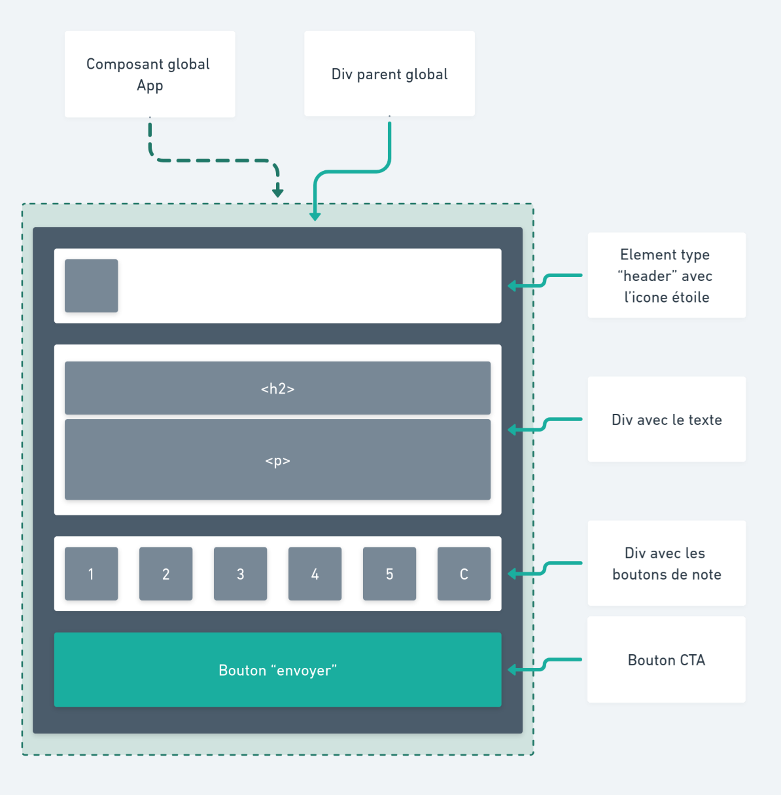
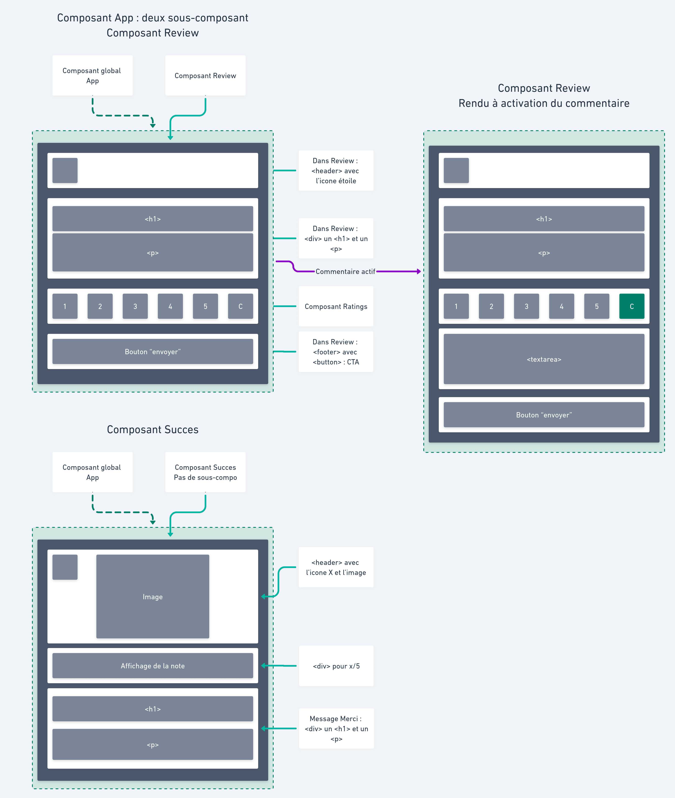

# Entrainement — Popup de notation


### **[Démo Live](https://rating.matthieu-munoz.fr)**

## Bienvenue ! 👋

Voici un exercice inspiré d'un challenge [Frontend Mentor](https://www.frontendmentor.io).

**Pour réaliser cet exercice, vous aurez besoin de connaissances de base en HTML, CSS (SCSS) et JavaScript (React/redux).**

## "Tu me notes combien ?" :

Cet exercice pourra vous être utile sur plusieurs projets !

En effet, imaginons ce petit composant d'envoi d'avis sur votre portfolio, il sera accessible sous forme de popup par l'appui sur un bouton ou un événement déclencheur… L'utilisateur pourra ainsi envoyer son avis sous forme de note sur cinq avec l'option d'ajouter aussi un court message.

Cet exercice est prévu pour guider la réalisation de ce composant avec React et Sass. Libre à vous d'en faire ce que vous voulez !

### Description du projet

|                    Vue globale                    |              Vue au survol et clic              |
| :-----------------------------------------------: | :---------------------------------------------: |
|                 |  |
|               Vue commentaire actif               |              Confirmation d'envoi               |
|  |  |

### Objectifs :

- L'utilisateur doit pouvoir choisir une note entre 1 et 5
  - Une note doit être sélectionnée pour exécuter l'envoi
- À l'appui sur le bouton *commentaire*, un champ pour taper du texte s'affiche
  - Si un commentaire est entré, alors l'envoyer en plus de la note
- Suite à l'envoi, afficher un message de succès avec la note envoyée.

Ici, nous gérons uniquement les fonctionnalités directes. L'objectif final et d'afficher en console.log la note laissé par l'utilisateur à l'envoi et potentiellement le commentaire.
En cas réel, on pourrait imaginer l'envoi d'un mail contenant la note ainsi que le commentaire, ou bien de stocker tous les avis dans une base de données (utilisation possible d'une api)

## Initialisation du projet

Cet exercice est livré avec un fichier package.json déjà rempli, toutes les dépendances utilisées y sont déjà configurées.

Il vous reste donc à :

1. Cloner ce repo
2. Ouvrir un terminal dans le répertoire
3. Faire un ```yarn```
4. Ouvrir dans VS Code à partir du terminal avec un ```code . ```
5. Pour lancer le serveur de dev, faire un ```yarn start```

## Pas à pas

### 1. Prise en main de l'exercice

On commence par parcourir l'environnement de travail, les divers dossiers/fichiers déjà en place.
Les ressources à pointer sont :

- Ce README
- Le fichier [style-guide](./style-guide.md) contenant les informations dont vous aurez besoin, telles que la palette de couleurs et les polices.
- Les images du dossier doc/design ainsi que la [Démo Live](https://rating.matthieu-munoz.fr) pour bien comprendre.
- Le fichier package.json pour connaitre les dépendances installées. Je vous aide avec les quelques notables :
  - classnames ⇒ Permet au besoin de conditionner une variable à destination d'un className. Très utile pour des styles différents en fonction d'une class/d'un état.
  - react-autosize-textarea ⇒ Permet l'ajout d'un composant textarea "autosizeable". Plus d'infos [ici](https://github.com/buildo/react-autosize-textarea) et [là pour comprendre](https://react-components.buildo.io/#textareaautosize)
  - react-icons ⇒ Donne accès à une multitude d'icônes très facilement, [à consulter](https://react-icons.github.io/react-icons/)
  - react-tooltip ⇒ Permet d'afficher et de paramétrer des petits tooltip très facilement. [doc](https://github.com/wwayne/react-tooltip#readme) et [démo](https://wwayne.github.io/react-tooltip/)
  - react, react-dom, react-redux, redux, prop-types" ⇒ Pour des raisons évidentes
- La branche *intégration-HTML/SCSS* contenant une intégration "brut" possible dans le composant principal.
- La branche *solution-matthieu* contenant une solution complète possible

### 2. "Par où je commence ?"

C'est LA question que l'on se pose tous au démarrage d'un projet…
Tout va dépendre de votre confort en HTML/JSX et CSS.
Par exemple, il est tout à fait envisageable de commencer par travailler dans le fichier [index.js](./src/components/App/index.js) du composant principal ainsi que l'[index.scss](./src/styles/index.scss). On y réalise l'intégralité de l'intégration (sans les interactions JS) avant de venir tout découper dans les bons composants.
C'est d'ailleurs la démarche que je vous conseille pour commencer et que j'expliquerai ensuite.
Une autre approche bien plus rapide, mais qui demande beaucoup de rigueur et une compréhension assez avancée du chemin à prendre ; c'est de directement coder dans les composants et fichier SCSS correspondant. L'idée là, c'est d'aller de l'extérieur le plus global vers l'intérieur progressivement.

### 3. HTML/SCSS

C'est parti pour l'intégration !

#### 3.1 Direction les [styles "racines"](./src/styles)

La première étape que je conseille, c'est de consulter la charte graphique ou les docs objectifs pour vraiment prendre conscience du projet. Ici, on a en racine du repo un fichier [style-guide](./style-guide.md) contenant les styles utilisés pour la démo. 
On va commencer par poser les différentes variables qui seront utiles et surtout utiliser pendant tout le projet. Ici, ça va être principalement des couleurs. POur cela, on va copier le contenu du [style-guide](./style-guide.md) dans [_vars.scss](./src/styles/_vars.scss) pour le reformater en différentes variables Sass qui seront utilisables à travers tout notre projet.

```scss
// Exemple possible avec des couleurs
$rouge-fonce: #8B0000;
$rouge-clair: #DC143C;
// ainsi que l'assignation à d'autre variable
$accentColor: $rouge-clair;
$backgroudColor: $rouge-fonce;
// Comme ça, si un jour le besoin de changer la couleur de fond se présente on change tout ici et pas dans CHAQUE fichier où il est utilisé.
```

Libre à vous de jouer avec les couleurs !

<details>
  <summary>Solution possible pour le fichier _Vars.scss</summary>

  ```scss
  // colors variable
  $green: hsl(144, 29%, 43%);
  $white: hsl(0, 0%, 100%);
  $light-grey: hsl(217, 12%, 63%);
  $dark-blue: hsl(213, 19%, 18%);
  $very-dark-blue: hsl(217, 14%, 19%);
  $gradientColors: hsl(215, 20%, 17%) 0%, hsl(216, 24%, 12%) 100%;
  // Used throughout the project
  $accentColor: $green;
  $gradient: radial-gradient(ellipse at top, $gradientColor);

  // Fonts
  $font-main: 'Overpass';
  $fw-classic: 400;
  $fw-bold: 700;
  ```

</details>

On continue ensuite avec la mise en place de notre SCSS de base, celui qui englobe tout : [index.scss](./src/styles/index.scss)
Cette feuille de style fait référence directe au fichier [index.html](./src/assets/index.html) et sera commun sur toute l'app. C'est donc ici que l'on va écrire les styles de fond qui s'appliqueront sur toute notre app.
Ici deux éléments à styliser : body et #root.
On appliquera au body les propriétés de polices (sans oublier de les inclure à l'index.html de assets) puis à #root un arrière-plan, une taille correspondante à la fenêtre ainsi qu'un centrage de ses éléments au centre.

La page que l'on obtient est complètement grise (couleur de l'arrière-plan) et prête à recevoir notre composant App qui se retrouvera au centre de notre page.
<details>
  <summary>Solution possible pour le fichier index.scss</summary>

  ```scss
  @use 'reset';
  @use 'vars';

  body {
    font-family: vars.$font-main, sans-serif;
    font-size: 16px;
    font-weight: vars.$fw-classic;
    line-height: 1.6em;
  }

  #root {
    display: grid;
    place-content: center;
    height: 100vh;
    width: 100%;
    background-color: vars.$very-dark-blue;
  }
  ```

</details>

#### 3.2 On ajoute de la forme

Nous allons pour le moment travailler dans le composant App. Libre à vous de le renommer à souhait.
On veut construire toute la structure HTML de notre "popup" dans [son état au chargement](./doc/design/1.%20Desktop.png).

Un peu de préparation, prenez l'image fournie et poser dans votre tête ou sur papier la structure globale qu'aura votre HTML (éléments parents/enfants, etc).
Pour cela ou peut faire une schématisation par boite, chaque boite représente un élément qui peuvent eux-mêmes en contenir d'autre qui représente leurs enfants.

<details>
  <summary>Schéma proposé</summary>

  

  Avec un schéma comme celui-ci on devine très facilement à quoi ressemblera notre HTML. On voit même déjà apparaitre certaines propriétés CSS !
  Par exemple, l'élément global aura surement un `display: flex;` en colonne, de même celui des boutons de note un `display: flex;` et une répartition sur la longueur.
  
</details>

Une fois cette préparation effectuée, on se lance.
On créait chaque élément HTML au bon endroit et on leur attribue une class. Le mieux c'est d'utiliser la convention BEM pour le nommage des class. Cela nous facilitera grandement la vie pour la mise en style Sass.

Cette convention peut faire peur, voici un petit récap de comment l'utiliser :

- Chaque class prend la class de son parent et ajout un mot clé séparé d'un '__'
- Si une class est répété pour une modification, on met un '--' entre

exemple :

```JSX
  <div className="app">
    <header className="app__header">
      <h1 className="app__header__title app__header__title--dark"> Super titre</h1>
    </header>
  </div>
```

Cette notation est assez lourde, on le voit bien là dans l'exemple avec le mot 'app' est répété quatre fois !
Vous pouvez prendre des libertés et tordre un peu la règle à votre avantage.
L'intégration suivante est disponible sur la branche 'intégration'

<details>
  <summary>Une structuration possible pour notre app</summary>

  ```JSX
    <div className="app">
      <div className="review">
        <header className="review__header">
          <div className="review__header__icon" />
        </header>
        <div className="review__content">
          <h2 className="review__content__title">Qu'en avez-vous pensé ?</h2>
          <p className="review__content__text">Vous pouvez donner votre avis sur ce que vous venez de voir. Tous
            les commentaires comptent pour m'aider à m'améliorer !
          </p>
        </div>
        <div className="review__ratings">
          <button type="button" className="review__ratings__btn">1</button>
          <button type="button" className="review__ratings__btn">2</button>
          <button type="button" className="review__ratings__btn review__ratings__btn--selected">3</button>
          <button type="button" className="review__ratings__btn">4</button>
          <button type="button" className="review__ratings__btn">5</button>
          <button type="button" className="review__ratings__btn review__ratings__btn--comment">C</button>
        </div>

        <button className="review__submit" type="button">Envoyer</button>
      </div>
    </div>
  ```

</details>

Ici on pose la forme, le contenu ne s'avère pas encore si important. Je vous conseille de quand même de garder des textes de proportion similaire voir directement les bons pour que la stylisation soit correcte.

#### Petit aparté ~ Icône

Sur notre application on voit deux icons, une étoile et une bulle de commentaire. Sur le web, il existe mille et une versions d'utiliser des icons, ici je vous propose d'en utiliser une très puissante disponible grâce à react-icons.

<details>
  <summary>Avec le style correspondant</summary>

  ```SCSS
    @use 'src/styles/_vars.scss';

    .app {
      max-width: 412px;
      min-height: 416px;
      background: vars.$gradient;
      display: flex;
      justify-content: space-between;
      flex-direction: column;
      align-items: center;
      padding: 2rem;
      border-radius: 2rem;

      .review {
        display: flex;
        justify-content: space-between;
        flex-direction: column;
        align-items: center;
        height: 100%;
        position: relative;


        &__header {
          align-self: start;

          &__icon {
            background-color: vars.$dark-blue;
            color: vars.$accentColor;
            width: 48px;
            height: 48px;
            border-radius: 2em;
            padding: 0.9em;
          }
        }

        &__content {
          margin: auto;

          &__title {
            color: vars.$white;
            font-weight: vars.$fw-bold;
            font-size: 1.5em;
            line-height: 2em;
          }

          &__text {
            color: vars.$light-grey;
          }
        }

        &__submit {
          width: 95%;
          height: 3rem;
          background-color: vars.$accentColor;
          color: vars.$white;
          border: none;
          border-radius: 2em;
          font-weight: vars.$fw-bold;
          letter-spacing: 0.15em;
          font-size: 1.1em;
          transition: all 0.2s ease-in-out;

          &:hover {
            background-color: vars.$white;
            color: vars.$accentColor;
            transition: all 0.2s ease-in-out;
          }
        }


        &__ratings {
          width: 95%;
          display: flex;
          justify-content: space-between;
          margin-top: auto;
          margin-bottom: 1rem;

          &__btn {
            height: 3rem;
            width: 3rem;
            display: grid;
            place-content: center;
            font-weight: vars.$fw-bold;
            border: none;
            border-radius: 1.5rem;
            background-color: vars.$dark-blue;
            color: vars.$light-grey;
            transition: all 0.2s ease-in-out;

            &:hover {
              background-color: vars.$light-grey;
              color: vars.$white;
              transform: scale(1.05);
              transition: all 0.2s ease-in-out;

            }

            &--selected {
              background-color: vars.$green;
              color: vars.$white;
            }

            &--comment {
              font-size: 1.5em;
            }
          }
        }
      }
    }

  ```
  
</details>

### 4. Délimitation des composants et structuration de /src

Nous allons réaliser ce projet en utilisant le couple React-Redux. De ce fait une architecture de dossier s'impose.
Commençons par lister les composants globaux de notre exercice. Pour cela, comprenons qu'est-ce qui nécessite la création d'un composant ou non.
Une approche possible est de diviser l'app en composant par zone "graphique"/sémantique. On peut aussi découper en composant par éléments répétés ou avec un contenu dynamique. Par exemple, un bouton que l'on retrouve à plusieurs endroits dans notre intégration pourrait être un composant, une zone qui utilise des données du State pourrait aussi être un composant.
En bref, on serait capable de faire un composant pour un peu tout et n'importe quoi, c'est donc à vous de trouver votre découpage, celui qui vous convient.

*De plus, la première découpe n'est qu'indicatif et peut tout à fait évoluer au fur est à mesure que le projet avance.*

<details>
  <summary>Possibilité de découpage des composants</summary>

J'ai choisi découper cette app en 4 composants :
  
- Un composant principal - *App* - qui se charge d'afficher, soit l'interface de notation, soit le message de succès
- Le composant - *Review* - qui gère l'interface de notation
- Le sous-composant - *Ratings* - qui s'occupe des boutons de note ainsi que celui de commentaire
- Un composant - *Comment* - permettant l'affichage d'un textarea pour laisser un commentaire en plus d'une note
- Et enfin le composant - *Succes* - qui affiche le message de succès.
  
 

  ```bash
    ├── components
    │   ├── Comment
    │   │   ├── index.js
    │   │   └── styles.scss
    │   ├── Ratings
    │   │   ├── index.js
    │   │   └── styles.scss
    │   ├── App
    │   │   ├── index.js
    │   │   └── styles.scss
    │   ├── Review
    │   │   ├── index.js
    │   │   └── styles.scss
    │   └── Succes
    │       ├── index.js
    │       └── styles.scss
  ```

</details>

Une fois les composants posés, on peut commencer la structure de notre projet React-Redux.
Nous aurons besoin d'un dossier store, reducers, actions et un dernier dossier middlewares.

<details>
  <summary>Architecture de src complète</summary>
  
  ```bash
    src
    ├── actions
    │   └── index.js
    ├── assets
    │   ├── favicon.ico
    │   ├── fonts
    │   │   └── Roboto-Regular.ttf
    │   ├── images
    │   │   └── done-sent.svg
    │   └── index.html
    ├── components
    │   ├── Comment
    │   │   ├── index.js
    │   │   └── styles.scss
    │   ├── Ratings
    │   │   ├── index.js
    │   │   └── styles.scss
    │   ├── App
    │   │   ├── index.js
    │   │   └── styles.scss
    │   ├── Review
    │   │   ├── index.js
    │   │   └── styles.scss
    │   └── Succes
    │       ├── index.js
    │       └── styles.scss
    ├── middlewares
    │   ├── debug.js
    │   └── submitReview.js
    ├── reducers
    │   └── index.js
    ├── store
    │   └── index.js
    ├── styles
    │    ├── index.scss
    │    ├── _reset.css
    │    └── _vars.scss
    ├── index.js
  ```

</details>

### Bonus

Plusieurs petites fonctionnalités bonus sont envisageables :

- Un compteur de caractère dans la zone de commentaire
- Des toolkit affichant une petite bulle indicative sur certains boutons expliquant l'utilité de ceux-ci
- Une notification en cas d'essai d'envoi sans avoir mis de note
- Affichage du popup à partir d'un petit bouton fixe dans un coin de l'écran
- Passer à une notation par étoile, avec remplissage des étoiles précédentes comme indication
- ... Libre à vous d'en ajouter beaucoup d'autre !!

## **Team Apollo** 🚀
